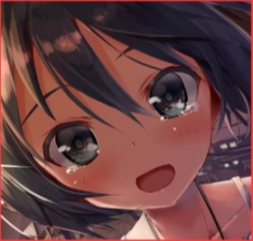
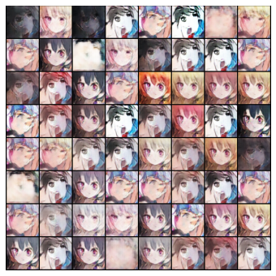
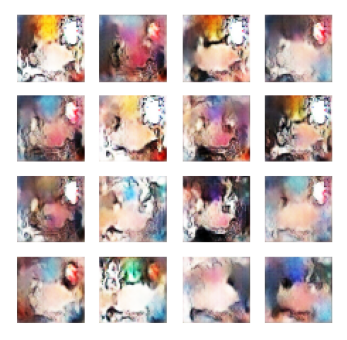
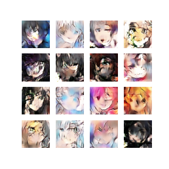
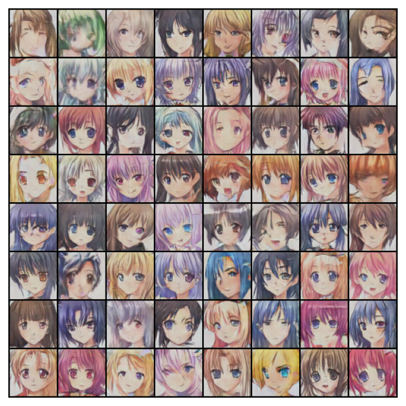
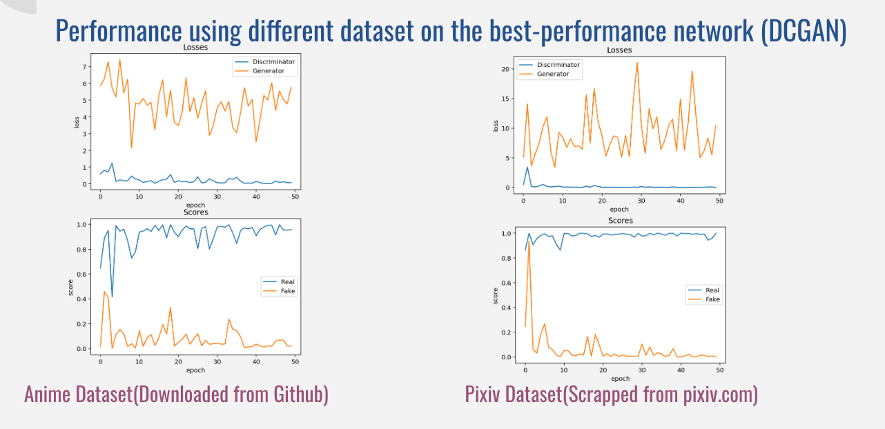

# DS301-final-project
# Anime Character Generator using DCGAN, WGAN, and WGAN-GP
created by Sihan Chen, Kellen Huang 

## Project description
The Anime Character Generator (ACG) is a project that uses machine learning to generate high-quality anime faces. 

The ACG uses a dataset of images to train and create synthesized anime faces that capture the patterns and details of the input. The ACG tests three different variants of Generative Adversarial Networks (GANs): Deep Convolutional Generative Adversarial Networks (DCGAN), Wasserstein Generative Adversarial Networks (WGAN), and WGAN with gradient penalty (WGAN-GP). 

The goal of this project is to determine which of these algorithms produces the highest quality output images while minimizing training time. But certainly, our primary goal is to make nice-looking anime waifu that we can customize ourselves. 

## Project Framework
**1. Scrap the Dataset from pixiv.com**
- Scrap the images using request;
- Using yolov5 (a pretrained facial detection model) for anime facial recognition, detecting anime faces from each input image.
 


 
**2. Construct three well-known GAN networks based on research papers**
- Deep Convolutional GAN (DCGAN): https://arxiv.org/abs/1511.06434
- Wasserstein GAN (WGAN):  https://arxiv.org/abs/1701.07875
- Wasserstein GAN GP(WGAN-GP): https://arxiv.org/abs/1704.00028
 
**3. Evaluate the task & outputs based on three metrics:**
- The quality of generated images of each model after 50 epochs;
- The evolution of performance over epochs (output of epochs 5, 15, 25, 35, 45);
- For the model that reached comparatively good performance, we will test the model’s performance on a different dataset, and calculate the score & loss to see whether the model performance could be generalized to different tasks.
 


**3. Evaluate the task & outputs based on three metrics:**
- The quality of generated images of each model after 50 epochs;
- The evolution of performance over epochs (output of epochs 5, 15, 25, 35, 45);
- For the model that reached comparatively good performance, we will test the model’s performance on a different dataset, and calculate the score & loss to see whether the model performance could be generalized to different tasks.


## Code Structure

```
├── data/ # the codes used to scrap & crop data from pixiv.com
|   ├── crop_images.ipynb	#image cropper
|   ├── get_images.ipynb #image scrapper
├── utils/ #directory for reusable tools
|   ├── data_preprocess.ipynb # import dataset & data preprocess
|   ├── eval.ipynb # evaluate loss & score
|   ├── visualize_outputs.ipynb #code scripts for image visualization
├── models/ # the directory for model training
|   ├── DCGAN_dataset1.ipynb # DCGAN using anime dataset
|   ├── DCGAN_dataset2.ipynb # DCGAN using pixiv dataset
|   ├── WGAN_train(bad case).ipynb # a collapsed wgan network(saved to record our progress)
|   ├── WGAN_train_better.ipynb #a better wgan model
|   ├── WGANGP_train.ipynb
├── sample_imgs/ #folder contains final outputs of each model
├── Anime Characters Generator (comprehensive demo).ipynb # a comprehensive code demo (10 epochs)
├── Output_Demo.ipynb #visualize the outputs
|   ...
```


## Example commands to execute the code
All the .ipynb files under /models/ directory are able to perform the comprehensive task (data import & preprocess – model construction – model training – output visualization & evaluation). 

After running the models, the image outputs will be generated under Google colab’s /content/ directory. 

(Please follow the instruction in the Colab notebooks)


## Results and Observations:
### 1. Performance on different networks using same dataset(Pixiv Dataset)
- From the outputs above, we can see that DCGAN has generated the images with the highest quality (with clearer human-like figure) after 50 epochs using the pixiv dataset.
- WGAN and WGAN-GP doesn’t generate valid outputs within 50 epochs– however, this may be the result of many different reasons, such as insufficient training epochs, unsuitable hyperparameters, etc.
**DCGAN:**
 

 
**WGAN:**
 

 
**WGAN-GP:**
 

 
### 2. Performance using different dataset on the best-performance network (DCGAN)
- For DCGAN, quality of generated images varies across different input;
- Loss & score produced by discriminator doesn’t reflect model performance– for instance, compared to using Pixiv dataset, DCGAN generated better quality images when using Anime dataset; however, the loss is overall lower while using Pixiv dataset.
 
**Anime Dataset with DCGAN:**


 
**Pixiv Dataset with DCGAN:**


 
**Loss & Scores:**




## References:

**Scrapping data:**
- Face detection: https://github.com/ultralytics/yolov5
- Dataset images scrap from: https://www.pixiv.net/
- 
**Models used:**
- DCGAN: https://pytorch.org/tutorials/beginner/dcgan_faces_tutorial.html
- Deep Convolutional GAN (DCGAN): https://arxiv.org/abs/1511.06434
- Wasserstein GAN (WGAN):  https://arxiv.org/abs/1701.07875
- Wasserstein GAN GP(WGAN-GP): https://arxiv.org/abs/1704.00028
